# Diagramas Mermaid Comparativos - Process Score

**Proyecto Base**: `process-score-sin-migrar`  
**Proyecto Migrado**: `process-score-migrado`  
**Versión**: 2.0.2

---

## 1. Arquitectura General - Comparativa

### 1.1. Proyecto Base (Sin Migrar)


### 1.2. Proyecto Migrado

```mermaid
graph TB
    subgraph "Cliente"
        Client[Cliente HTTP]
    end
    
    subgraph "Application Layer"
        REST["REST Endpoints ScoreService"]
        Routes["Routes Camel application/route"]
        RouteDecision["RouteDecisionBean ✨ NUEVO"]
        UseCases["Casos de Uso ✨ NUEVO"]
        DTOs["DTOs Input/Output ✨ REORGANIZADO"]
    end
    
    subgraph "Domain Layer"
        DomainBeans["Beans de Dominio ScoreBean, VariablesBean"]
        DomainServices["Servicios de Dominio ✨ NUEVO"]
        DomainEntity["Entidades Claims"]
        DomainRepo["Interfaces IClaimsRepository"]
    end
    
    subgraph "Infrastructure Layer"
        InfraBean["ConsumerBean ✅ Con Resiliencia"]
        Proxy["Proxies HTTP infrastructure/proxy"]
        Repo["Repositorios ClaimsRepository"]
    end
    
    subgraph "Resiliencia"
        Resilience["Resilience Starter ✨ NUEVO"]
        Metrics["Micrometer/Prometheus ✨ NUEVO"]
    end
    
    subgraph "Servicios Externos"
        Bantotal[Bantotal]
        Experian[Experian]
        BRMS[BRMS]
        Redis[Redis Cache]
    end
    
    Client --> REST
    REST --> Routes
    Routes --> RouteDecision
    RouteDecision --> DomainBeans
    DomainBeans --> DomainServices
    DomainBeans --> UseCases
    UseCases --> InfraBean
    InfraBean --> Resilience
    Resilience --> Proxy
    Proxy --> Bantotal
    Proxy --> Experian
    Proxy --> BRMS
    DomainBeans --> Repo
    Repo --> Redis
    Resilience --> Metrics
    
    style Resilience fill:#90EE90
    style Metrics fill:#90EE90
    style RouteDecision fill:#90EE90
    style DomainServices fill:#90EE90
    style UseCases fill:#90EE90
    style InfraBean fill:#90EE90
```



---

## 2. Estructura de Paquetes - Comparativa

### 2.1. Proyecto Base


### 2.2. Proyecto Migrado

```mermaid
graph TD
    Root[com.compartamos.process.score]
    
    Root --> App[application]
    Root --> Domain[domain]
    Root --> Infra[infrastructure]
    Root --> Cross[cross]
    
    App --> AppBean["bean ClaimsBean + camel/ ✨"]
    App --> AppConfig["config CORS, Redis, Jackson"]
    App --> AppContext["context TechnicalContext ✨"]
    App --> AppDto["dto input/ ✨ output/ ✨"]
    App --> AppRoute["route 6 RouteBuilders + RouteDecisionBean ✨"]
    App --> AppService["service ScoreService"]
    App --> AppUseCase["usecase 3 Casos de Uso ✨"]
    App --> AppUtil["util ServiceLocator ✨"]
    
    Domain --> DomAgg[aggregations]
    Domain --> DomBean["bean ScoreBean, VariablesBean ⚠️ Mantiene dependencias"]
    Domain --> DomEntity["entity Claims"]
    Domain --> DomRepo["irepository IClaimsRepository ⚠️ Mantiene dependencias"]
    Domain --> DomProc["proccess ⚠️ Mantiene dependencias"]
    Domain --> DomService["service 4 Servicios ✨"]
    
    Infra --> InfraBean["bean ConsumerBean ✅ Con Resiliencia"]
    Infra --> InfraProxy["proxy dto/ ✨ route/ ✨"]
    Infra --> InfraRepo["repository ClaimsRepository"]
    
    Cross --> CrossDto["dto ErrorResponseDto ✨"]
    Cross --> CrossExc["exception 5 Excepciones"]
    Cross --> CrossUtil["util 19 Utilidades ✨"]
    
    style AppContext fill:#90EE90
    style AppDto fill:#90EE90
    style AppRoute fill:#90EE90
    style AppUseCase fill:#90EE90
    style DomService fill:#90EE90
    style InfraBean fill:#90EE90
    style CrossDto fill:#90EE90
```



---

## 3. Flujo de Request - Comparativa

### 3.1. Proyecto Base: Flujo sin Resiliencia

```mermaid
sequenceDiagram
    participant Client
    participant REST as REST Endpoint
    participant Route as Camel Route
    participant Domain as Domain Bean
    participant Infra as ConsumerBean
    participant External as Servicio Externo
    
    Client->>REST: POST /score/get-score
    REST->>Route: direct:getScore
    Route->>Domain: ScoreBean.validarGestionCalificacion()
    Domain->>Route: Establece propiedades
    Route->>Infra: consumerBrmsScoreExperian()
    Note over Infra: ❌ Sin Timeout, ❌ Sin Circuit Breaker, ❌ Sin Retry
    Infra->>External: HTTP Request
    External-->>Infra: HTTP Response (o Timeout)
    Infra-->>Route: Exchange con respuesta
    Route-->>REST: Respuesta
    REST-->>Client: JSON Response
    
    Note over Infra,External: Si falla: Error propagado sin estrategia de recuperación
```



### 3.2. Proyecto Migrado: Flujo con Resiliencia

```mermaid
sequenceDiagram
    participant Client
    participant REST as REST Endpoint
    participant Route as Camel Route
    participant Decision as RouteDecisionBean
    participant Domain as Domain Bean
    participant DomainSvc as Domain Service
    participant Infra as ConsumerBean
    participant Resilience as Resilience Starter
    participant External as Servicio Externo
    participant Metrics as Prometheus
    
    Client->>REST: POST /score/get-score
    REST->>Route: direct:getScore
    Route->>Domain: ScoreBean.validarGestionCalificacion()
    Domain->>DomainSvc: ScoreDomainService
    DomainSvc-->>Domain: Lógica de negocio
    Domain->>Route: Establece propiedades
    Route->>Decision: RouteDecisionBean.isConsultaScoreExperian()
    Decision-->>Route: true/false
    Route->>Infra: consumerBrmsScoreExperian()
    Infra->>Resilience: Interceptores CDI
    Note over Resilience: ✅ @Timeout(2000ms), ✅ @CircuitBreaker, ✅ @Retry(maxRetries=1)
    Resilience->>External: HTTP Request (con timeout)
    alt Éxito
        External-->>Resilience: HTTP 200 OK
        Resilience->>Metrics: Registrar éxito
        Resilience-->>Infra: Respuesta exitosa
    else Timeout
        Resilience->>Metrics: Registrar timeout
        Resilience->>Resilience: @Retry (1 vez)
        Resilience->>External: Reintento HTTP
        alt Reintento Exitoso
            External-->>Resilience: HTTP 200 OK
            Resilience-->>Infra: Respuesta exitosa
        else Reintento Fallido
            Resilience-->>Infra: TimeoutException
        end
    else Circuit Breaker OPEN
        Resilience->>Metrics: Registrar Circuit Breaker OPEN
        Resilience-->>Infra: CircuitBreakerOpenException
    else Error HTTP
        Resilience->>Metrics: Registrar fallo
        Resilience->>Resilience: @Retry (1 vez)
        Resilience->>External: Reintento HTTP
        alt Reintento Exitoso
            External-->>Resilience: HTTP 200 OK
            Resilience-->>Infra: Respuesta exitosa
        else Reintento Fallido
            Resilience-->>Infra: Exception
        end
    end
    Infra-->>Route: Exchange con respuesta/error
    Route-->>REST: Respuesta o Error
    REST-->>Client: JSON Response o Error
    
    Note over Resilience,Metrics: Todas las operaciones se registran en métricas
```



---

## 4. Patrones de Resiliencia - Comparativa

### 4.1. Proyecto Base: Sin Patrones


### 4.2. Proyecto Migrado: Con Patrones

```mermaid
graph LR
    subgraph "Request Flow con Resiliencia"
        A[Cliente] --> B[REST]
        B --> C[Camel Route]
        C --> D[ConsumerBean]
        D --> E[Resilience Starter]
        
        E --> F["@Timeout 2000ms"]
        F -->|OK| G["@CircuitBreaker"]
        F -->|Timeout| R["@Retry"]
        
        G -->|CLOSED| H["@Retry maxRetries=1"]
        G -->|OPEN| S[CircuitBreakerOpenException]
        
        H -->|Primer Intento| I[HTTP Request]
        H -->|Reintento| R
        
        I --> J{Servicio Externo}
        J -->|Éxito| K[Respuesta Exitosa]
        J -->|Fallo| R
        
        R -->|Reintento OK| K
        R -->|Reintento Fallido| L{"Tiene Fallback"}
        
        L -->|Sí| M[Método Fallback]
        L -->|No| N[Error]
        
        M --> O[Respuesta Degradada]
        K --> P[Métricas Prometheus]
        S --> P
        N --> P
        O --> P
    end
    
    style E fill:#90EE90
    style F fill:#90EE90
    style G fill:#90EE90
    style H fill:#90EE90
    style L fill:#90EE90
    style M fill:#90EE90
    style P fill:#90EE90
```



---

## 5. Estructura de Dependencias - Comparativa

### 5.1. Proyecto Base


### 5.2. Proyecto Migrado

```mermaid
graph TD
    subgraph "Dependencias"
        Base[process-score:2.0.2]
        
        Base --> Q2[Quarkus 3.24.1 ⬆️]
        Base --> C2[Camel 3.24.1 ⬆️]
        Base --> J2[Jedis 3.3.0]
        Base --> JWT2[JJWT 0.12.6]
        Base --> Jasypt2[Jasypt 1.9.3]
        Base --> Guava2[Guava 33.2.0]
        Base --> Commons2[Commons Lang3 3.18.0]
        Base --> Netty2[Netty 4.2.4]
        Base --> Resilience[Resilience Starter 1.0.0-SNAPSHOT ✨]
        Base --> Micrometer[Micrometer/Prometheus ✨]
    end
    
    style Resilience fill:#90EE90
    style Micrometer fill:#90EE90
    style Q2 fill:#90EE90
    style C2 fill:#90EE90
```



---

## 6. Flujo de Integración con Servicios Externos - Comparativa

### 6.1. Proyecto Base: Sin Resiliencia


### 6.2. Proyecto Migrado: Con Resiliencia


---

## 7. Configuración de Resiliencia por Endpoint

### 7.1. Matriz de Resiliencia - Proyecto Migrado


---

## 8. Arquitectura de Capas - Comparativa Detallada

### 8.1. Proyecto Base


### 8.2. Proyecto Migrado

```mermaid
graph TB
    subgraph "Application Layer"
        AppRoute["Routes Camel 6 RouteBuilders + RouteDecisionBean ✨"]
        AppService["ScoreService REST Endpoints"]
        AppDTO["DTOs Input/Output ✨ Separados"]
        AppBean["ClaimsBean"]
        AppUseCase["3 Casos de Uso ✨"]
        AppContext["TechnicalContext ✨"]
    end
    
    subgraph "Domain Layer"
        DomBean["ScoreBean VariablesBean ⚠️ Mantiene dependencias"]
        DomService["4 Servicios de Dominio ✨"]
        DomEntity["Claims Entity"]
        DomRepo["IClaimsRepository ⚠️ Mantiene dependencias"]
    end
    
    subgraph "Infrastructure Layer"
        InfraBean["ConsumerBean ✅ Con Anotaciones @Timeout, @CircuitBreaker, @Retry, @Fallback"]
        InfraProxy["Proxy DTOs/Route ✨ Reorganizado"]
        InfraRepo["ClaimsRepository"]
    end
    
    subgraph "Resilience Layer"
        Resilience[Resilience Starter ✨]
        Metrics[Micrometer/Prometheus ✨]
    end
    
    subgraph "Cross Layer"
        CrossUtil["Utilidades 19 archivos ✨"]
        CrossExc["Excepciones 5 clases"]
        CrossDTO["ErrorResponseDto ✨"]
    end
    
    AppService --> AppRoute
    AppRoute --> AppUseCase
    AppRoute --> AppContext
    AppRoute --> AppUseCase
    AppUseCase --> DomBean
    AppUseCase --> DomService
    DomBean --> DomService
    DomBean --> InfraBean
    InfraBean --> Resilience
    Resilience --> InfraProxy
    Resilience --> Metrics
    DomBean --> DomRepo
    DomRepo --> InfraRepo
    
    style AppRoute fill:#90EE90
    style AppUseCase fill:#90EE90
    style AppContext fill:#90EE90
    style DomService fill:#90EE90
    style InfraBean fill:#90EE90
    style Resilience fill:#90EE90
    style Metrics fill:#90EE90
    style CrossDTO fill:#90EE90
```



---

## 9. Flujo de Decisión en Rutas - Comparativa

### 9.1. Proyecto Base: Decisiones Inline


### 9.2. Proyecto Migrado: Decisiones Centralizadas

```mermaid
graph TD
    A[Request] --> B[ScoreRouteBuilder]
    B --> C[ScoreBean.validarGestionCalificacion]
    C --> D[Establece exchangeProperty]
    D --> E["choice en DSL method RouteDecisionBean"]
    
    E -->|isConsultaScoreExperian| F[RouteDecisionBean ✨]
    E -->|otherwise| G[RouteDecisionBean ✨]
    
    F --> H[direct:processCalificacionExperian]
    G --> I[direct:processScoreCliente]
    
    H --> J[Procesa Calificación Experian]
    I --> K[Procesa Score Cliente]
    
    style E fill:#90EE90
    style F fill:#90EE90
    style G fill:#90EE90
    Note2["✅ Decisiones centralizadas, ✅ Fácil de testear, ✅ Fácil de mantener"]
    style Note2 fill:#90EE90
```



---

## 10. Testing - Comparativa

### 10.1. Proyecto Base

```mermaid
graph TD
    A[Proyecto Base] --> B[❌ Sin Tests]
    B --> C[src/test/]
    C --> D[No existe directorio]
    
    style B fill:#ffcccc
    style C fill:#ffcccc
    style D fill:#ffcccc
```



### 10.2. Proyecto Migrado


---

## 11. Observabilidad - Comparativa

### 11.1. Proyecto Base

```mermaid
graph LR
    A[Request] --> B[Procesamiento]
    B --> C[Logging JSON]
    C --> D[Elastic Stack]
    
    E[❌ Sin Métricas]
    F[❌ Sin Circuit Breaker Metrics]
    G[❌ Sin Retry Metrics]
    H[❌ Sin Timeout Metrics]
    
    style E fill:#ffcccc
    style F fill:#ffcccc
    style G fill:#ffcccc
    style H fill:#ffcccc
```



### 11.2. Proyecto Migrado

```mermaid
graph LR
    A[Request] --> B[Procesamiento]
    B --> C[Logging JSON]
    C --> D[Elastic Stack]
    
    B --> E[Resilience Starter]
    E --> F[Micrometer]
    F --> G[Prometheus]
    G --> H["Endpoint /q/metrics"]
    
    E --> I[Circuit Breaker Metrics]
    E --> J[Retry Metrics]
    E --> K[Timeout Metrics]
    E --> L[Fallback Metrics]
    
    I --> F
    J --> F
    K --> F
    L --> F
    
    style E fill:#90EE90
    style F fill:#90EE90
    style G fill:#90EE90
    style H fill:#90EE90
    style I fill:#90EE90
    style J fill:#90EE90
    style K fill:#90EE90
    style L fill:#90EE90
```

---

## 12. Resumen de Cambios - Vista General

```mermaid
graph TB
    subgraph "Proyecto Base"
        Base1[Quarkus 3.23.1]
        Base2[Sin Resiliencia]
        Base3[Sin Tests]
        Base4[README Básico]
        Base5[Sin Métricas]
        Base6[Decisiones Inline]
    end
    
    subgraph "Proyecto Migrado"
        Mig1[Quarkus 3.24.1 ⬆️]
        Mig2[Resilience Starter ✅]
        Mig3[18 Tests ✅]
        Mig4[README Completo ✅]
        Mig5[Micrometer/Prometheus ✅]
        Mig6[RouteDecisionBean ✅]
        Mig7[Servicios Dominio ✅]
        Mig8[Casos de Uso ✅]
    end
    
    Base1 -.Migración.-> Mig1
    Base2 -.Migración.-> Mig2
    Base3 -.Migración.-> Mig3
    Base4 -.Migración.-> Mig4
    Base5 -.Migración.-> Mig5
    Base6 -.Migración.-> Mig6
    
    style Base2 fill:#ffcccc
    style Base3 fill:#ffcccc
    style Base4 fill:#ffcccc
    style Base5 fill:#ffcccc
    style Base6 fill:#ffcccc
    
    style Mig2 fill:#90EE90
    style Mig3 fill:#90EE90
    style Mig4 fill:#90EE90
    style Mig5 fill:#90EE90
    style Mig6 fill:#90EE90
    style Mig7 fill:#90EE90
    style Mig8 fill:#90EE90
```

---

## 13. Matriz de Resiliencia por Endpoint

```mermaid
graph LR
    subgraph "Fase 1: Timeout"
        T1[BRMS] --> T2["2000ms"]
        T3["Bantotal Score"] --> T4["2500ms"]
        T5["Experian Obtener"] --> T6["3000ms"]
        T7["Experian Crear"] --> T8["3000ms"]
    end
    
    subgraph "Fase 2: Circuit Breaker"
        CB1[BRMS] --> CB2["12 req, 40% fail"]
        CB3["Bantotal Score"] --> CB4["12 req, 40% fail"]
        CB5["Experian Obtener"] --> CB6["12 req, 40% fail"]
        CB7["Experian Crear"] --> CB8["12 req, 40% fail"]
    end
    
    subgraph "Fase 3: Retry + Fallback"
        R1[BRMS] --> R2["Retry 1x"]
        R3["Bantotal Score"] --> R4["Retry 1x"]
        R5["Experian Obtener"] --> R6["Retry 1x"]
        R7["Experian Crear"] --> R8["Sin Retry"]
        R9["Experian SOAP"] --> R10["Retry + Fallback"]
    end
    
    style T2 fill:#90EE90
    style T4 fill:#90EE90
    style T6 fill:#90EE90
    style T8 fill:#90EE90
    style CB2 fill:#90EE90
    style CB4 fill:#90EE90
    style CB6 fill:#90EE90
    style CB8 fill:#90EE90
    style R2 fill:#90EE90
    style R4 fill:#90EE90
    style R6 fill:#90EE90
    style R8 fill:#FFD700
    style R10 fill:#87CEEB
```

---

## 14. Dependencias - Comparativa Visual

### 14.1. Proyecto Base: Dependencias Incluidas

```mermaid
pie title Dependencias Proyecto Base
    "Quarkus/Camel Core" : 30
    "Redis (Jedis/Lettuce)" : 10
    "JWT (JJWT/Nimbus)" : 10
    "Utilidades (Guava/Commons)" : 10
    "HTTP Clients (OkHttp/HttpMime)" : 10
    "RabbitMQ (Camel/AMQP)" : 10
    "Mapeo (ModelMapper)" : 5
    "Testing" : 5
    "No Utilizadas" : 10
```

### 14.2. Proyecto Migrado: Dependencias Optimizadas

```mermaid
pie title Dependencias Proyecto Migrado
    "Quarkus/Camel Core" : 35
    "Redis (Jedis)" : 10
    "JWT (JJWT)" : 10
    "Utilidades (Guava/Commons)" : 10
    "Resilience Starter" : 15
    "Micrometer/Prometheus" : 10
    "Testing" : 5
    "No Utilizadas" : 5
```

---

## 15. Flujo Completo End-to-End - Comparativa

### 15.1. Proyecto Base: Flujo Simple

```mermaid
graph TD
    Start[Cliente HTTP] --> REST[REST Endpoint]
    REST --> Route[Camel Route]
    Route --> Bean[Domain Bean]
    Bean --> Consumer[ConsumerBean]
    Consumer --> HTTP["HTTP Request Sin Protección"]
    HTTP --> Ext[Servicio Externo]
    Ext -->|Éxito| Success[Respuesta]
    Ext -->|Fallo| Error[Error]
    Success --> Response[Respuesta al Cliente]
    Error --> Response
    
    style HTTP fill:#ffcccc
    style Error fill:#ffcccc
```

### 15.2. Proyecto Migrado: Flujo con Resiliencia

```mermaid
graph TD
    Start[Cliente HTTP] --> REST[REST Endpoint]
    REST --> Route[Camel Route]
    Route --> Decision[RouteDecisionBean ✨]
    Decision --> Bean[Domain Bean]
    Bean --> DomainSvc[Domain Service ✨]
    DomainSvc --> Consumer[ConsumerBean]
    Consumer --> Resilience[Resilience Starter ✨]
    
    Resilience --> Timeout["@Timeout"]
    Timeout -->|OK| CB["@CircuitBreaker"]
    Timeout -->|Timeout| Retry["@Retry"]
    
    CB -->|CLOSED| HTTP[HTTP Request]
    CB -->|OPEN| CBError[CircuitBreakerOpen]
    
    HTTP --> Ext[Servicio Externo]
    Ext -->|Éxito| Success[Respuesta]
    Ext -->|Fallo| Retry
    
    Retry -->|Reintento OK| Success
    Retry -->|Reintento Fallido| Fallback{"Tiene Fallback"}
    
    Fallback -->|Sí| FallbackMethod[Método Fallback]
    Fallback -->|No| Error[Error]
    
    Success --> Metrics[Métricas Prometheus ✨]
    CBError --> Metrics
    Error --> Metrics
    FallbackMethod --> Metrics
    
    Success --> Response[Respuesta al Cliente]
    CBError --> Response
    Error --> Response
    FallbackMethod --> Response
    
    style Resilience fill:#90EE90
    style Timeout fill:#90EE90
    style CB fill:#90EE90
    style Retry fill:#90EE90
    style Fallback fill:#90EE90
    style Metrics fill:#90EE90
    style Decision fill:#90EE90
    style DomainSvc fill:#90EE90
```

---

## 16. Leyenda de Símbolos

### Colores
- 🟢 **Verde (#90EE90)**: Nuevo/Mejorado en proyecto migrado
- 🔴 **Rojo (#ffcccc)**: Problema/Mejora necesaria
- 🟡 **Amarillo (#FFD700)**: Crítico/Sin retry
- 🔵 **Azul (#87CEEB)**: Con fallback

### Símbolos
- ✅: Implementado/Correcto
- ❌: No implementado/Problema
- ⚠️: Advertencia/Mejora necesaria
- ✨: Nuevo en proyecto migrado
- ⬆️: Actualizado

---

**Fin de Diagramas Comparativos**
