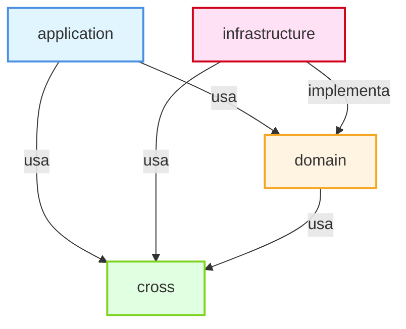
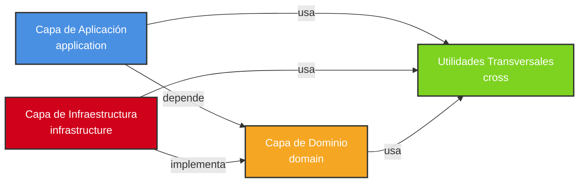
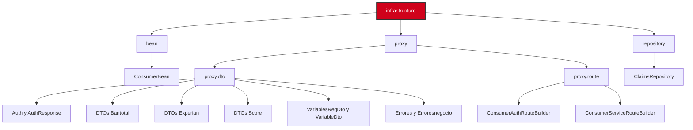
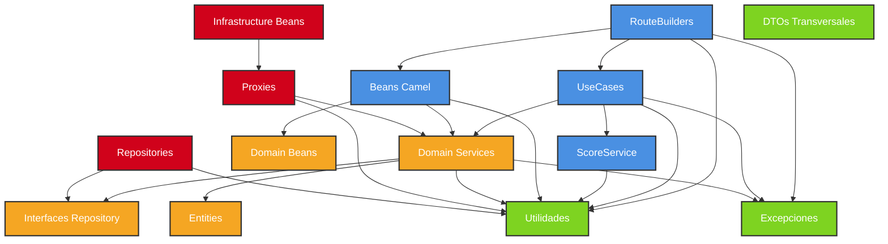
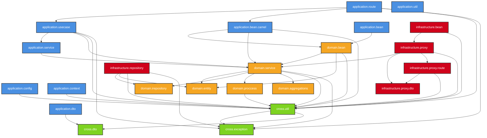

# Estructura de Paquetes - Process Score

## 📌 Nota sobre Visualización de Diagramas

Si no puedes visualizar los diagramas Mermaid en tu editor, puedes:

1. **Usar un visor online**: Copia el código Mermaid y pégalo en:
   - [Mermaid Live Editor](https://mermaid.live/)
   - [Mermaid.ink](https://mermaid.ink/)

2. **Instalar extensiones**:
   - **VS Code**: Extensión "Markdown Preview Mermaid Support"
   - **GitHub/GitLab**: Los diagramas se renderizan automáticamente
   - **IntelliJ IDEA**: Plugin "Mermaid"

3. **Ver la versión de texto** en la sección "📋 Versión Texto de Diagramas" más abajo.

---

## 📦 Diagrama de Estructura General



## 🏗️ Arquitectura Hexagonal - Capas



## 📂 Estructura Detallada de Paquetes

### 1. Capa de Aplicación (`application`)

```mermaid
graph TD
    APP[application]
    
    APP --> BEAN[bean]
    APP --> CONFIG[config]
    APP --> CONTEXT[context]
    APP --> DTO[dto]
    APP --> ROUTE[route]
    APP --> SERVICE[service]
    APP --> USECASE[usecase]
    APP --> UTIL[util]
    
    BEAN --> BEAN_CAMEL[bean.camel]
    BEAN --> BEAN_CLAIMS[ClaimsBean]
    
    BEAN_CAMEL --> BASE_CAMEL[BaseCamelBean]
    BEAN_CAMEL --> CATALOGUE_CAMEL[CatalogueCamelBean]
    BEAN_CAMEL --> SCORE_CAMEL[ScoreCamelBean]
    BEAN_CAMEL --> VARIABLES_CAMEL[VariablesCamelBean]
    
    CONFIG --> CORS[CORSFilter]
    CONFIG --> DATE_DS[DateDeserializer]
    CONFIG --> DATE_MD[DateModule]
    CONFIG --> DATE_SR[DateSerializer]
    CONFIG --> JACKSON[JacksonContextResolver]
    CONFIG --> REDIS[RedisPoolConnection]
    
    CONTEXT --> TECH_CTX[TechnicalContext]
    
    DTO --> DTO_INPUT[dto.input]
    DTO --> DTO_OUTPUT[dto.output]
    DTO --> DTO_MAIN[DTOs principales]
    
    DTO_INPUT --> REQ_SCORE[ObtenerScoreClienteRequest]
    DTO_INPUT --> REQ_VARS[ConsultarVariablesRccRequest]
    DTO_INPUT --> REQ_EXP[ConsultarCalificacionExperianRequest]
    
    DTO_OUTPUT --> RES_SCORE[ObtenerScoreClienteResponse]
    DTO_OUTPUT --> RES_VARS[ConsultarVariablesRccResponse]
    DTO_OUTPUT --> RES_EXP[ConsultarCalificacionExperianResponse]
    
    DTO_MAIN --> CALIF_EXP[CalificacionExperian]
    DTO_MAIN --> CALIF_EXP_DTO[CalificacionExperianDto]
    DTO_MAIN --> CLAIMS_DTO[ClaimsDto]
    DTO_MAIN --> CLIENTE_EXP[ClienteExperian]
    DTO_MAIN --> CLIENTE_EXP_DTO[ClienteExperianDto]
    DTO_MAIN --> EXP_RESP[ExperianResponseDto]
    DTO_MAIN --> GEST_CALIF[GestionCalificacionResponseDto]
    DTO_MAIN --> RESP_CALIF[RespuestaCalificacionExperianDto]
    DTO_MAIN --> SCORE_REQ[ScorePersonaRequestDto]
    DTO_MAIN --> SCORE_RESP[ScorePersonaResponse]
    
    ROUTE --> MAIN_RT[MainRouteBuilder]
    ROUTE --> AUTH_RT[AuthRouteBuilder]
    ROUTE --> CATALOGUE_RT[CatalogueRouteBuilder]
    ROUTE --> CLAIMS_RT[ClaimsRouteBuilder]
    ROUTE --> SCORE_RT[ScoreRouteBuilder]
    ROUTE --> VARIABLES_RT[VariablesRouteBuilder]
    ROUTE --> DECISION[RouteDecisionBean]
    
    SERVICE --> SCORE_SVC[ScoreService]
    
    USECASE --> UC_SCORE[ObtenerScoreClienteUseCase]
    USECASE --> UC_VARS[ConsultarVariablesRccUseCase]
    USECASE --> UC_EXP[ConsultarCalificacionExperianUseCase]
    
    UTIL --> SVC_LOC[ServiceLocator]
    
    classDef appClass fill:#4a90e2,stroke:#333,stroke-width:2px,color:#fff
    class APP appClass
```



### 2. Capa de Dominio (`domain`)

```mermaid
graph TD
    DOM[domain]
    
    DOM --> AGG[aggregations]
    DOM --> BEAN[bean]
    DOM --> ENTITY[entity]
    DOM --> IREPO[irepository]
    DOM --> PROC[proccess]
    DOM --> SERVICE[service]
    
    AGG --> AGG_PROPS[AggregationProperties]
    
    BEAN --> BASE_BEAN[BaseBean]
    BEAN --> CATALOGUE_BEAN[CatalogueBean]
    BEAN --> SCORE_BEAN[ScoreBean]
    BEAN --> VARIABLES_BEAN[VariablesBean]
    
    ENTITY --> CLAIMS_ENT[Claims]
    
    IREPO --> I_CLAIMS_REPO[IClaimsRepository]
    
    PROC --> ASSIGN_TOKEN[AssignTokenBtProcessor]
    PROC --> CREDENTIALS[CredentialsBtProcessor]
    
    SERVICE --> DOC_SVC[DocumentDomainService]
    SERVICE --> EXP_SVC[ExperianDomainService]
    SERVICE --> SCORE_SVC[ScoreDomainService]
    SERVICE --> VAL_SVC[ValidationDomainService]
    
    classDef domainClass fill:#f5a623,stroke:#333,stroke-width:2px,color:#fff
    class DOM domainClass
```



### 3. Capa de Infraestructura (`infrastructure`)



### 4. Utilidades Transversales (`cross`)

```mermaid
graph TD
    CROSS[cross]
    
    CROSS --> DTO[dto]
    CROSS --> EXCEPTION[exception]
    CROSS --> UTIL[util]
    
    DTO --> ERROR_DTO[ErrorResponseDto]
    
    EXCEPTION --> BASE_EXC[BaseAppException]
    EXCEPTION --> JSON_EXC[JsonParsingException]
    EXCEPTION --> PROPS_EXC[PropertiesLoadException]
    EXCEPTION --> ROUTE_EXC[RouteConfigurationException]
    EXCEPTION --> SESSION_EXC[SessionValidationException]
    
    UTIL --> BASE_PROXY[BaseProxyResponse]
    UTIL --> BASE_RESP[BaseResponse]
    UTIL --> CONSTANTS[Constants]
    UTIL --> ERROR_PROC[ErrorResponseProcessor]
    UTIL --> FUNCTIONS[Functions]
    UTIL --> HTTP_ERROR[HttpErrorMapper]
    UTIL --> INIT_FILTER[InitFilterRouteBuilder]
    UTIL --> JACKSON_CUST[JacksonCustomizer]
    UTIL --> JWT_CONTEXT[JwtContextFilterProcessor]
    UTIL --> JWT_UTIL[JwtUtil]
    UTIL --> LOGGER[LoggerTrace]
    UTIL --> MESSAGES[Messages]
    UTIL --> PROPERTIES[Properties]
    UTIL --> REQ_CTX[RequestContextProcessor]
    UTIL --> RESP_FORMAT[ResponseFormatterProcessor]
    UTIL --> ROOT_RT[RootRouteBuilder]
    UTIL --> SESSION_VAL[SessionValidator]
    UTIL --> SINGLETON_PROPS[SingletonProperties]
    UTIL --> URI_SANIT[UriSanitizerProcessor]
    
    classDef crossClass fill:#7ed321,stroke:#333,stroke-width:2px,color:#fff
    class CROSS crossClass
```



## 🔄 Flujo de Dependencias entre Capas



## 🔗 Relaciones Detalladas entre Paquetes



## 📊 Resumen de Paquetes por Capa

### Capa de Aplicación (Application Layer)
- **Propósito**: Orquestación, casos de uso y adaptadores de entrada
- **Paquetes principales**:
  - `application.bean.camel`: Beans de procesamiento Camel
  - `application.config`: Configuraciones (Redis, Jackson, CORS)
  - `application.context`: Contexto técnico
  - `application.dto`: DTOs de entrada y salida
  - `application.route`: Rutas Camel (orquestación)
  - `application.service`: Servicios de aplicación
  - `application.usecase`: Casos de uso
  - `application.util`: Utilidades de aplicación

### Capa de Dominio (Domain Layer)
- **Propósito**: Lógica de negocio y entidades del dominio
- **Paquetes principales**:
  - `domain.aggregations`: Agregados de dominio
  - `domain.bean`: Beans de dominio (lógica de negocio)
  - `domain.entity`: Entidades de dominio
  - `domain.irepository`: Interfaces de repositorio
  - `domain.proccess`: Procesadores de dominio
  - `domain.service`: Servicios de dominio

### Capa de Infraestructura (Infrastructure Layer)
- **Propósito**: Implementaciones técnicas y adaptadores de salida
- **Paquetes principales**:
  - `infrastructure.bean`: Beans de infraestructura
  - `infrastructure.proxy`: Proxies a servicios externos (Bantotal, Experian)
  - `infrastructure.proxy.dto`: DTOs de comunicación con servicios externos
  - `infrastructure.proxy.route`: Rutas Camel para consumir servicios externos
  - `infrastructure.repository`: Implementaciones de repositorios

### Utilidades Transversales (Cross Layer)
- **Propósito**: Utilidades compartidas y manejo de excepciones
- **Paquetes principales**:
  - `cross.dto`: DTOs transversales (ErrorResponseDto)
  - `cross.exception`: Excepciones personalizadas
  - `cross.util`: Utilidades generales (JWT, logging, validación, etc.)

## 🔍 Detalle de Archivos por Paquete

### application/bean/camel
- `BaseCamelBean.java`: Clase base para beans Camel
- `CatalogueCamelBean.java`: Bean para procesamiento de catálogos
- `ScoreCamelBean.java`: Bean para procesamiento de scores
- `VariablesCamelBean.java`: Bean para procesamiento de variables RCC

### application/config
- `CORSFilter.java`: Filtro CORS
- `DateDeserializer.java`: Deserializador de fechas
- `DateModule.java`: Módulo de configuración de fechas para Jackson
- `DateSerializer.java`: Serializador de fechas
- `JacksonContextResolver.java`: Resolver de contexto Jackson
- `RedisPoolConnection.java`: Pool de conexiones Redis

### application/route
- `MainRouteBuilder.java`: Configuración principal de rutas REST
- `AuthRouteBuilder.java`: Rutas de autenticación
- `CatalogueRouteBuilder.java`: Rutas de catálogos
- `ClaimsRouteBuilder.java`: Rutas de claims JWT
- `ScoreRouteBuilder.java`: Rutas de score
- `VariablesRouteBuilder.java`: Rutas de variables RCC
- `RouteDecisionBean.java`: Bean para decisiones de ruteo

### application/usecase
- `ObtenerScoreClienteUseCase.java`: Caso de uso para obtener score
- `ConsultarVariablesRccUseCase.java`: Caso de uso para consultar variables RCC
- `ConsultarCalificacionExperianUseCase.java`: Caso de uso para consultar Experian

### domain/bean
- `BaseBean.java`: Clase base para beans de dominio
- `CatalogueBean.java`: Bean de lógica de negocio para catálogos
- `ScoreBean.java`: Bean de lógica de negocio para scores
- `VariablesBean.java`: Bean de lógica de negocio para variables

### domain/service
- `DocumentDomainService.java`: Servicio de dominio para documentos
- `ExperianDomainService.java`: Servicio de dominio para Experian
- `ScoreDomainService.java`: Servicio de dominio para scores
- `ValidationDomainService.java`: Servicio de dominio para validaciones

### infrastructure/proxy/dto
Contiene 53 DTOs para comunicación con servicios externos:
- DTOs de Bantotal (SdtsBT*, Sbt*, Jcms*)
- DTOs de Experian (ClienteExperian*, ConsultarExperian*)
- DTOs de Score (ObtenerScore*, Sdt*)
- DTOs de Variables (VariablesReqDto, VariableDto)
- DTOs de Autenticación (Auth, AuthResponse)
- DTOs de Errores (Errores, Erroresnegocio, ErrPreSol)

### cross/util
Utilidades transversales clave:
- `JwtUtil.java`: Utilidades para JWT
- `SessionValidator.java`: Validador de sesiones
- `ErrorResponseProcessor.java`: Procesador de respuestas de error
- `ResponseFormatterProcessor.java`: Formateador de respuestas
- `LoggerTrace.java`: Utilidades de logging
- `RootRouteBuilder.java`: Builder base para rutas
- `Properties.java`: Gestión de propiedades
- `Constants.java`: Constantes del sistema

## 📈 Estadísticas del Proyecto

- **Total de archivos Java**: ~135 archivos
- **Capa de Aplicación**: ~35 archivos
- **Capa de Dominio**: ~12 archivos
- **Capa de Infraestructura**: ~58 archivos (mayormente DTOs de proxy)
- **Utilidades Transversales**: ~30 archivos

## 🎯 Principios de Organización

1. **Separación de Responsabilidades**: Cada capa tiene un propósito claro
2. **Dependencias Unidireccionales**: La aplicación depende del dominio, la infraestructura implementa el dominio
3. **Inversión de Dependencias**: El dominio define interfaces, la infraestructura las implementa
4. **Reutilización**: Utilidades transversales compartidas
5. **Testabilidad**: Separación clara facilita pruebas unitarias

## 📋 Versión Texto de Diagramas (Alternativa)

Si no puedes visualizar los diagramas Mermaid, aquí tienes una versión en texto ASCII:

### Estructura General de Capas

```
┌─────────────────┐
│   application   │
└────────┬────────┘
         │ usa
         ├─────────────────┐
         │                 │
         ▼                 ▼
┌─────────────────┐  ┌──────────────┐
│     domain      │  │    cross     │
└────────┬────────┘  └──────────────┘
         │ usa              ▲
         │                  │
         └──────────────────┘
         │
         │ implementa
         │
┌─────────────────┐
│ infrastructure  │
└─────────────────┘
```

### Relaciones Detalladas entre Paquetes

```
┌─────────────────────────────────────────────────────────────────┐
│                    CAPA DE APLICACIÓN                            │
├─────────────────────────────────────────────────────────────────┤
│                                                                  │
│  application.route ──┐                                          │
│         │            │                                           │
│         ├────────────┼──► application.usecase                    │
│         │            │         │                                 │
│         │            │         ├──► application.service         │
│         │            │         │                                 │
│         │            │         └──► domain.service               │
│         │            │                                           │
│         └────────────┼──► application.bean.camel                │
│                      │         │                                 │
│                      │         ├──► domain.bean                 │
│                      │         │                                 │
│                      │         └──► domain.service              │
│                      │                                           │
│                      └──► cross.util                           │
│                                                                  │
└─────────────────────────────────────────────────────────────────┘
                              │
                              ▼
┌─────────────────────────────────────────────────────────────────┐
│                      CAPA DE DOMINIO                             │
├─────────────────────────────────────────────────────────────────┤
│                                                                  │
│  domain.bean ──┐                                                │
│       │        │                                                │
│       │        ├──► domain.service                              │
│       │        │         │                                       │
│       │        │         ├──► domain.entity                     │
│       │        │         │                                       │
│       │        │         ├──► domain.irepository                │
│       │        │         │                                       │
│       │        │         ├──► domain.proccess                   │
│       │        │         │                                       │
│       │        │         └──► domain.aggregations              │
│       │        │                                                │
│       │        └──► cross.util                                  │
│       │                                                         │
│       └──► cross.util                                           │
│                                                                  │
└─────────────────────────────────────────────────────────────────┘
                              │
                              ▼
┌─────────────────────────────────────────────────────────────────┐
│                  CAPA DE INFRAESTRUCTURA                         │
├─────────────────────────────────────────────────────────────────┤
│                                                                  │
│  infrastructure.proxy ──┐                                       │
│           │              │                                       │
│           │              ├──► domain.service                    │
│           │              │                                       │
│           │              ├──► infrastructure.proxy.dto           │
│           │              │                                       │
│           │              └──► infrastructure.proxy.route        │
│           │                                                      │
│           └──► cross.util                                       │
│                                                                  │
│  infrastructure.repository ──┐                                  │
│           │                   │                                  │
│           │                   ├──► domain.irepository           │
│           │                   │                                  │
│           │                   ├──► domain.entity                │
│           │                   │                                  │
│           │                   └──► cross.util                   │
│                                                                  │
│  infrastructure.bean ──┐                                       │
│           │             │                                       │
│           │             └──► infrastructure.proxy               │
│           │                                                      │
│           └──► cross.util                                       │
│                                                                  │
└─────────────────────────────────────────────────────────────────┘
                              │
                              ▼
┌─────────────────────────────────────────────────────────────────┐
│              UTILIDADES TRANSVERSALES (CROSS)                    │
├─────────────────────────────────────────────────────────────────┤
│                                                                  │
│  cross.util ──┐                                                 │
│       │       │                                                  │
│       │       ├──► cross.exception                              │
│       │       │                                                  │
│       │       └──► cross.dto                                    │
│       │                                                          │
│       └──► (usado por todas las capas)                          │
│                                                                  │
└─────────────────────────────────────────────────────────────────┘
```

### Árbol de Estructura de Paquetes

```
com.compartamos.process.score
│
├── application
│   ├── bean
│   │   ├── camel
│   │   │   ├── BaseCamelBean
│   │   │   ├── CatalogueCamelBean
│   │   │   ├── ScoreCamelBean
│   │   │   └── VariablesCamelBean
│   │   └── ClaimsBean
│   ├── config
│   │   ├── CORSFilter
│   │   ├── DateDeserializer
│   │   ├── DateModule
│   │   ├── DateSerializer
│   │   ├── JacksonContextResolver
│   │   └── RedisPoolConnection
│   ├── context
│   │   └── TechnicalContext
│   ├── dto
│   │   ├── input
│   │   │   ├── ObtenerScoreClienteRequest
│   │   │   ├── ConsultarVariablesRccRequest
│   │   │   └── ConsultarCalificacionExperianRequest
│   │   ├── output
│   │   │   ├── ObtenerScoreClienteResponse
│   │   │   ├── ConsultarVariablesRccResponse
│   │   │   └── ConsultarCalificacionExperianResponse
│   │   └── [DTOs principales]
│   ├── route
│   │   ├── MainRouteBuilder
│   │   ├── AuthRouteBuilder
│   │   ├── CatalogueRouteBuilder
│   │   ├── ClaimsRouteBuilder
│   │   ├── ScoreRouteBuilder
│   │   ├── VariablesRouteBuilder
│   │   └── RouteDecisionBean
│   ├── service
│   │   └── ScoreService
│   ├── usecase
│   │   ├── ObtenerScoreClienteUseCase
│   │   ├── ConsultarVariablesRccUseCase
│   │   └── ConsultarCalificacionExperianUseCase
│   └── util
│       └── ServiceLocator
│
├── domain
│   ├── aggregations
│   │   └── AggregationProperties
│   ├── bean
│   │   ├── BaseBean
│   │   ├── CatalogueBean
│   │   ├── ScoreBean
│   │   └── VariablesBean
│   ├── entity
│   │   └── Claims
│   ├── irepository
│   │   └── IClaimsRepository
│   ├── proccess
│   │   ├── AssignTokenBtProcessor
│   │   └── CredentialsBtProcessor
│   └── service
│       ├── DocumentDomainService
│       ├── ExperianDomainService
│       ├── ScoreDomainService
│       └── ValidationDomainService
│
├── infrastructure
│   ├── bean
│   │   └── ConsumerBean
│   ├── proxy
│   │   ├── dto
│   │   │   ├── [53 DTOs de servicios externos]
│   │   │   ├── Auth / AuthResponse
│   │   │   ├── DTOs Bantotal
│   │   │   ├── DTOs Experian
│   │   │   ├── DTOs Score
│   │   │   └── DTOs Variables
│   │   └── route
│   │       ├── ConsumerAuthRouteBuilder
│   │       └── ConsumerServiceRouteBuilder
│   └── repository
│       └── ClaimsRepository
│
└── cross
    ├── dto
    │   └── ErrorResponseDto
    ├── exception
    │   ├── BaseAppException
    │   ├── JsonParsingException
    │   ├── PropertiesLoadException
    │   ├── RouteConfigurationException
    │   └── SessionValidationException
    └── util
        ├── BaseProxyResponse
        ├── BaseResponse
        ├── Constants
        ├── ErrorResponseProcessor
        ├── Functions
        ├── HttpErrorMapper
        ├── InitFilterRouteBuilder
        ├── JacksonCustomizer
        ├── JwtContextFilterProcessor
        ├── JwtUtil
        ├── LoggerTrace
        ├── Messages
        ├── Properties
        ├── RequestContextProcessor
        ├── ResponseFormatterProcessor
        ├── RootRouteBuilder
        ├── SessionValidator
        ├── SingletonProperties
        └── UriSanitizerProcessor
```

### Flujo de Dependencias Simplificado

```
ENTRADA (HTTP/REST)
    │
    ▼
application.route ──► application.usecase ──► application.service
    │                       │                        │
    │                       │                        │
    │                       ▼                        │
    │              domain.service ◄─────────────────┘
    │                       │
    │                       ├──► domain.entity
    │                       │
    │                       ├──► domain.irepository
    │                       │        ▲
    │                       │        │
    │                       │        │ implementa
    │                       │        │
    │                       │  infrastructure.repository
    │                       │
    │                       └──► infrastructure.proxy
    │
    └──► application.bean.camel ──► domain.bean
                                         │
                                         └──► domain.service

TODAS LAS CAPAS ──► cross.util ──► cross.exception
                                    ──► cross.dto
```

---

**Versión del Documento**: 1.1  
**Fecha**: 2024  
**Proyecto**: process-score v2.0.2
