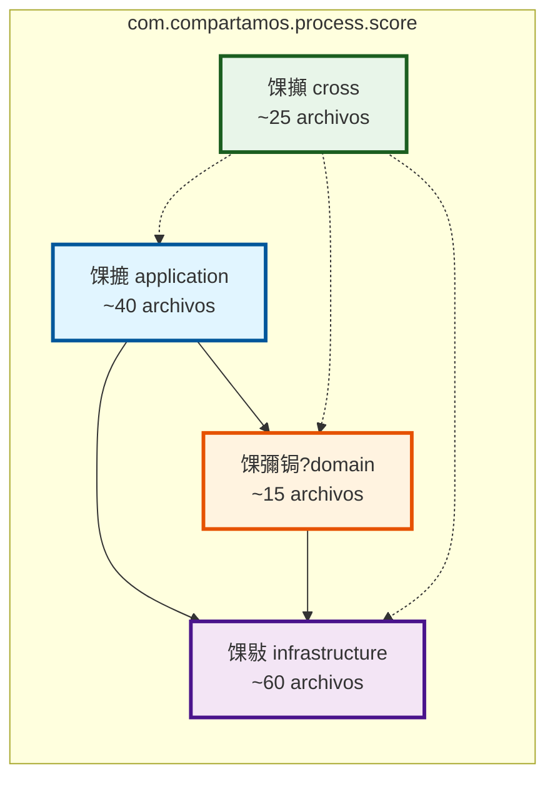

# Estructura de Paquetes - Process Score

## Diagrama Mermaid de la Estructura de Paquetes

### Vista Jer谩rquica Completa

```mermaid
graph TB
    Root["com.compartamos.process.score"]
    
    %% Capa Application
    App["application"]
    AppBean["bean"]
    AppBeanCamel["camel"]
    AppConfig["config"]
    AppContext["context"]
    AppDto["dto"]
    AppDtoInput["input"]
    AppDtoOutput["output"]
    AppRoute["route"]
    AppService["service"]
    AppUseCase["usecase"]
    AppUtil["util"]
    
    %% Capa Domain
    Domain["domain"]
    DomainAgg["aggregations"]
    DomainBean["bean"]
    DomainEntity["entity"]
    DomainIRepo["irepository"]
    DomainProc["proccess"]
    DomainService["service"]
    
    %% Capa Infrastructure
    Infra["infrastructure"]
    InfraBean["bean"]
    InfraProxy["proxy"]
    InfraProxyDto["dto"]
    InfraProxyRoute["route"]
    InfraRepo["repository"]
    
    %% Capa Cross
    Cross["cross"]
    CrossDto["dto"]
    CrossException["exception"]
    CrossUtil["util"]
    
    %% Relaciones Application
    Root --> App
    App --> AppBean
    App --> AppConfig
    App --> AppContext
    App --> AppDto
    App --> AppRoute
    App --> AppService
    App --> AppUseCase
    App --> AppUtil
    AppBean --> AppBeanCamel
    AppDto --> AppDtoInput
    AppDto --> AppDtoOutput
    
    %% Relaciones Domain
    Root --> Domain
    Domain --> DomainAgg
    Domain --> DomainBean
    Domain --> DomainEntity
    Domain --> DomainIRepo
    Domain --> DomainProc
    Domain --> DomainService
    
    %% Relaciones Infrastructure
    Root --> Infra
    Infra --> InfraBean
    Infra --> InfraProxy
    Infra --> InfraRepo
    InfraProxy --> InfraProxyDto
    InfraProxy --> InfraProxyRoute
    
    %% Relaciones Cross
    Root --> Cross
    Cross --> CrossDto
    Cross --> CrossException
    Cross --> CrossUtil
    
    %% Estilos por capa
    classDef appLayer fill:#e1f5ff,stroke:#01579b,stroke-width:2px,color:#000
    classDef domainLayer fill:#fff3e0,stroke:#e65100,stroke-width:2px,color:#000
    classDef infraLayer fill:#f3e5f5,stroke:#4a148c,stroke-width:2px,color:#000
    classDef crossLayer fill:#e8f5e9,stroke:#1b5e20,stroke-width:2px,color:#000
    classDef rootLayer fill:#ffebee,stroke:#c62828,stroke-width:3px,color:#000
    
    class Root rootLayer
    class App,AppBean,AppBeanCamel,AppConfig,AppContext,AppDto,AppDtoInput,AppDtoOutput,AppRoute,AppService,AppUseCase,AppUtil appLayer
    class Domain,DomainAgg,DomainBean,DomainEntity,DomainIRepo,DomainProc,DomainService domainLayer
    class Infra,InfraBean,InfraProxy,InfraProxyDto,InfraProxyRoute,InfraRepo infraLayer
    class Cross,CrossDto,CrossException,CrossUtil crossLayer
```

### Vista Simplificada por Capas

### Diagrama de 脕rbol de Paquetes

```mermaid
graph TD
    Root["com.compartamos.process.score"]
    
    Root --> App["application"]
    Root --> Domain["domain"]
    Root --> Infra["infrastructure"]
    Root --> Cross["cross"]
    
    App --> App1["bean/camel"]
    App --> App2["config"]
    App --> App3["context"]
    App --> App4["dto/input"]
    App --> App5["dto/output"]
    App --> App6["route"]
    App --> App7["service"]
    App --> App8["usecase"]
    App --> App9["util"]
    
    Domain --> Dom1["aggregations"]
    Domain --> Dom2["bean"]
    Domain --> Dom3["entity"]
    Domain --> Dom4["irepository"]
    Domain --> Dom5["proccess"]
    Domain --> Dom6["service"]
    
    Infra --> Inf1["bean"]
    Infra --> Inf2["proxy/dto"]
    Infra --> Inf3["proxy/route"]
    Infra --> Inf4["repository"]
    
    Cross --> Cr1["dto"]
    Cross --> Cr2["exception"]
    Cross --> Cr3["util"]
    
    classDef appLayer fill:#e1f5ff,stroke:#01579b
    classDef domainLayer fill:#fff3e0,stroke:#e65100
    classDef infraLayer fill:#f3e5f5,stroke:#4a148c
    classDef crossLayer fill:#e8f5e9,stroke:#1b5e20
    
    class App,App1,App2,App3,App4,App5,App6,App7,App8,App9 appLayer
    class Domain,Dom1,Dom2,Dom3,Dom4,Dom5,Dom6 domainLayer
    class Infra,Inf1,Inf2,Inf3,Inf4 infraLayer
    class Cross,Cr1,Cr2,Cr3 crossLayer
```

## Descripci贸n Detallada de Paquetes

### 馃摝 Capa Application (`com.compartamos.process.score.application`)

Capa de aplicaci贸n que contiene la l贸gica de orquestaci贸n y casos de uso.

#### `application.bean`
- **`camel/`**: Beans de integraci贸n con Camel
  - `BaseCamelBean.java`
  - `CatalogueCamelBean.java`
  - `ScoreCamelBean.java`
  - `VariablesCamelBean.java`
- `ClaimsBean.java`: Bean para gesti贸n de claims

#### `application.config`
Configuraciones de la aplicaci贸n:
- `CORSFilter.java`: Filtro CORS
- `DateDeserializer.java`: Deserializador de fechas
- `DateModule.java`: M贸dulo de configuraci贸n de fechas
- `DateSerializer.java`: Serializador de fechas
- `JacksonContextResolver.java`: Resolver de contexto Jackson
- `RedisPoolConnection.java`: Pool de conexiones Redis

#### `application.context`
- `TechnicalContext.java`: Contexto t茅cnico de la aplicaci贸n

#### `application.dto`
DTOs de la capa de aplicaci贸n:
- **`input/`**: DTOs de entrada
  - `ConsultarCalificacionExperianRequest.java`
  - `ConsultarVariablesRccRequest.java`
  - `ObtenerScoreClienteRequest.java`
- **`output/`**: DTOs de salida
  - `ConsultarCalificacionExperianResponse.java`
  - `ConsultarVariablesRccResponse.java`
  - `ObtenerScoreClienteResponse.java`
- Otros DTOs:
  - `CalificacionExperian.java`
  - `CalificacionExperianDto.java`
  - `ClaimsDto.java`
  - `ClienteExperian.java`
  - `ClienteExperianDto.java`
  - `ExperianResponseDto.java`
  - `GestionCalificacionResponseDto.java`
  - `RespuestaCalificacionExperianDto.java`
  - `ScorePersonaRequestDto.java`
  - `ScorePersonaResponse.java`

#### `application.route`
Rutas Camel para orquestaci贸n:
- `AuthRouteBuilder.java`: Rutas de autenticaci贸n
- `CatalogueRouteBuilder.java`: Rutas de cat谩logos
- `ClaimsRouteBuilder.java`: Rutas de claims
- `MainRouteBuilder.java`: Ruta principal
- `RouteDecisionBean.java`: Bean de decisiones de ruta
- `ScoreRouteBuilder.java`: Rutas de score
- `VariablesRouteBuilder.java`: Rutas de variables

#### `application.service`
- `ScoreService.java`: Servicio de aplicaci贸n para score

#### `application.usecase`
Casos de uso de la aplicaci贸n:
- `ConsultarCalificacionExperianUseCase.java`
- `ConsultarVariablesRccUseCase.java`
- `ObtenerScoreClienteUseCase.java`

#### `application.util`
- `ServiceLocator.java`: Localizador de servicios

---

### 馃彌锔?Capa Domain (`com.compartamos.process.score.domain`)

Capa de dominio que contiene la l贸gica de negocio pura.

#### `domain.aggregations`
- `AggregationProperties.java`: Propiedades de agregaciones

#### `domain.bean`
Beans de dominio con l贸gica de negocio:
- `BaseBean.java`: Bean base
- `CatalogueBean.java`: Bean de cat谩logos
- `ScoreBean.java`: Bean de score
- `VariablesBean.java`: Bean de variables

#### `domain.entity`
- `Claims.java`: Entidad de dominio Claims

#### `domain.irepository`
Interfaces de repositorio:
- `IClaimsRepository.java`: Interfaz del repositorio de Claims

#### `domain.proccess`
Procesadores de dominio:
- `AssignTokenBtProcessor.java`: Procesador de asignaci贸n de token Bantotal
- `CredentialsBtProcessor.java`: Procesador de credenciales Bantotal

#### `domain.service`
Servicios de dominio:
- `DocumentDomainService.java`: Servicio de documentos
- `ExperianDomainService.java`: Servicio de Experian
- `ScoreDomainService.java`: Servicio de score
- `ValidationDomainService.java`: Servicio de validaci贸n

---

### 馃敡 Capa Infrastructure (`com.compartamos.process.score.infrastructure`)

Capa de infraestructura que implementa adaptadores externos.

#### `infrastructure.bean`
- `ConsumerBean.java`: Bean consumidor de infraestructura

#### `infrastructure.proxy`
Proxies a servicios externos:
- **`dto/`**: DTOs de comunicaci贸n con servicios externos (53 archivos)
  - DTOs de Bantotal: `Btinreq.java`, `Btoutreq.java`, `SdtsBTScorePersona.java`, etc.
  - DTOs de Experian: `ClienteExperianRequest.java`, `ClienteExperianResponse.java`, etc.
  - DTOs de autenticaci贸n: `Auth.java`, `AuthResponse.java`
  - DTOs de cat谩logos: `CatalogoDto.java`
  - DTOs de score: `ObtenerScoreRequest.java`, `ObtenerScoreResponse.java`, etc.
  - DTOs de variables: `VariablesReqDto.java`, `VariableDto.java`
  - DTOs de errores: `BTErrorNegocio.java`, `Errores.java`, `Erroresnegocio.java`, etc.
- **`route/`**: Rutas de proxy
  - `ConsumerAuthRouteBuilder.java`: Rutas de autenticaci贸n del consumidor
  - `ConsumerServiceRouteBuilder.java`: Rutas de servicios del consumidor

#### `infrastructure.repository`
Implementaciones de repositorios:
- `ClaimsRepository.java`: Implementaci贸n del repositorio de Claims

---

### 馃攧 Capa Cross (`com.compartamos.process.score.cross`)

Capa transversal con utilidades compartidas.

#### `cross.dto`
- `ErrorResponseDto.java`: DTO de respuesta de error

#### `cross.exception`
Excepciones personalizadas:
- `BaseAppException.java`: Excepci贸n base de la aplicaci贸n
- `JsonParsingException.java`: Excepci贸n de parsing JSON
- `PropertiesLoadException.java`: Excepci贸n de carga de propiedades
- `RouteConfigurationException.java`: Excepci贸n de configuraci贸n de rutas
- `SessionValidationException.java`: Excepci贸n de validaci贸n de sesi贸n

#### `cross.util`
Utilidades transversales (19 archivos):
- `BaseProxyResponse.java`: Respuesta base de proxy
- `BaseResponse.java`: Respuesta base
- `Constants.java`: Constantes
- `ErrorResponseProcessor.java`: Procesador de respuestas de error
- `Functions.java`: Funciones utilitarias
- `HttpErrorMapper.java`: Mapeador de errores HTTP
- `InitFilterRouteBuilder.java`: Constructor de ruta de filtro inicial
- `JacksonCustomizer.java`: Personalizador de Jackson
- `JwtContextFilterProcessor.java`: Procesador de filtro de contexto JWT
- `JwtUtil.java`: Utilidades JWT
- `LoggerTrace.java`: Logger de trazas
- `Messages.java`: Mensajes
- `Properties.java`: Propiedades
- `RequestContextProcessor.java`: Procesador de contexto de petici贸n
- `ResponseFormatterProcessor.java`: Procesador de formateo de respuesta
- `RootRouteBuilder.java`: Constructor de ruta ra铆z
- `SessionValidator.java`: Validador de sesi贸n
- `SingletonProperties.java`: Propiedades singleton
- `UriSanitizerProcessor.java`: Procesador de sanitizaci贸n de URI

---

## Estad铆sticas del Proyecto

- **Total de archivos Java**: 135 archivos
- **Capa Application**: ~40 archivos
- **Capa Domain**: ~15 archivos
- **Capa Infrastructure**: ~60 archivos (principalmente DTOs de proxy)
- **Capa Cross**: ~25 archivos

## Arquitectura

El proyecto sigue una **Arquitectura Hexagonal** con las siguientes capas:

1. **Application**: Orquestaci贸n, casos de uso y rutas Camel
2. **Domain**: L贸gica de negocio pura, entidades y servicios de dominio
3. **Infrastructure**: Adaptadores externos, proxies y repositorios
4. **Cross**: Utilidades transversales compartidas

## Tecnolog铆as Principales

- **Framework**: Quarkus 3.24.1
- **Integraci贸n**: Apache Camel
- **Java**: 21
- **Build**: Maven
- **Cach茅**: Redis (Jedis)
- **Seguridad**: JWT (jjwt)
- **Documentaci贸n**: OpenAPI/Swagger
